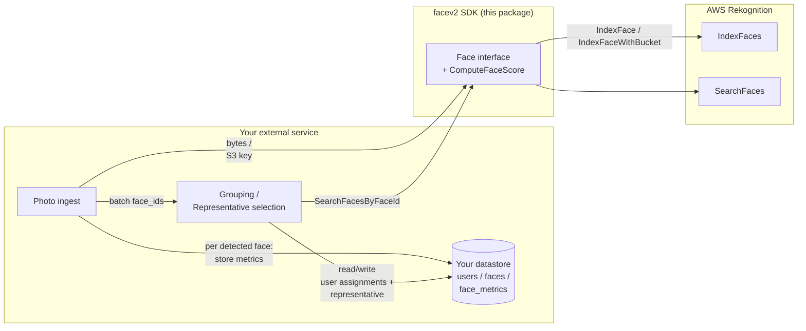
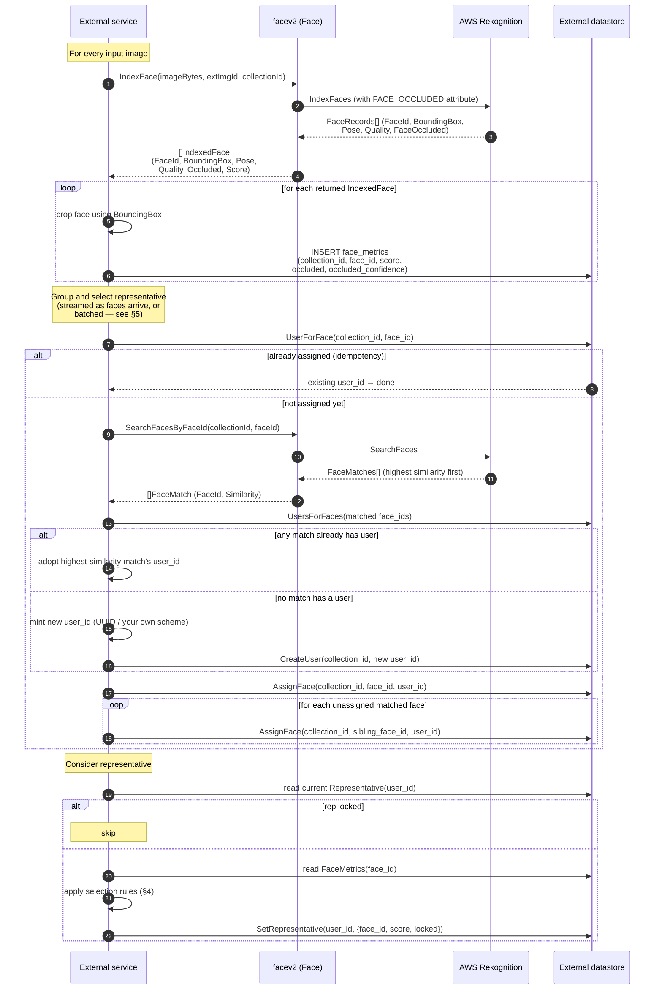

# facev2 — Integration guide for external services

`facev2` is a **thin SDK wrapper around AWS Rekognition's face APIs**. It
does one job: hand your service a small, typed view of Rekognition's
`IndexFaces` and `SearchFaces` responses, with a ready-to-use per-face
score. Everything above that layer — clustering faces of the same person
into a "user", picking one face as that user's representative thumbnail,
persisting any of that state — is the caller's responsibility.

The reference implementation of that upper layer lives in
[`facev2/simulation`](./simulation/) (grouping) and
[`facev2/store`](./store/) (SQLite persistence), driven end-to-end against
real AWS by [`cmd/facesmoketest`](../cmd/facesmoketest/). Those are
examples, not part of the SDK. This document explains how to re-build them
against your own datastore, service topology, and operational constraints
— such that you end up with the same face → user grouping and
representative-thumbnail choices as the reference implementation.

---

## 1. Architecture at a glance



**Responsibility split:**

| Concern | Owned by |
|---|---|
| Ingest images, decode, crop | External service |
| Call `IndexFaces` / `SearchFaces` | facev2 SDK |
| Compute per-face score (pose + occlusion + quality) | facev2 SDK (`ComputeFaceScore`) |
| Batch, retry, dedupe | External service (SDK provides retry only for `SearchFaces`) |
| Cluster faces → users | External service |
| Mint & persist user_id | External service |
| Track each user's representative thumbnail | External service |
| Serve/expose results | External service |

facev2 makes exactly two kinds of AWS calls: `IndexFaces` (once per input
image) and `SearchFaces` (once per never-before-seen face during
grouping). It never calls Rekognition's `CreateUser`, `AssociateFaces`, or
`SearchUsersByFaceId` APIs — locally-minted user IDs replace all of that.

---

## 2. End-to-end sequence

Below is the exact sequence the reference implementation follows and that
your external service should mirror to reproduce its DB state.



The rest of this doc goes call-by-call and then explains the scoring +
selection rules referenced above.

---

## 3. SDK reference — call by call

The `Face` interface (in [`engine.go`](./engine.go)) is the whole SDK
surface a caller needs to talk to AWS Rekognition:

```go
type Face interface {
    IndexFace(ctx context.Context, image []byte, externalImageId string, collectionId string) ([]IndexedFace, error)
    IndexFaceWithBucket(ctx context.Context, s3Bucket string, s3Key string, externalImageId string, collectionId string) ([]IndexedFace, error)
    SearchFacesByFaceId(ctx context.Context, collectionId string, faceId string, opts ...SearchFacesOption) ([]FaceMatch, error)
}
```

Get a real implementation via `facev2.NewRekognitionFaceIndexer(client)`.
All three methods return a **non-nil (possibly empty) slice** on success —
callers can range over the result without a nil-check — and never return
partial results with a non-nil error.

### 3.1 `Face.IndexFace(ctx, imageBytes, externalImageId, collectionId)`

Indexes every face detected in `imageBytes` into `collectionId` on AWS
Rekognition and returns per-face metadata.

**Signature:**

```go
IndexFace(ctx context.Context, imageBytes []byte, externalImageId, collectionId string) ([]IndexedFace, error)
```

**When to call.** Once per input image, at ingest time. The returned
`FaceId`s are the identity handles you'll persist and later hand to
`SearchFacesByFaceId` during grouping.

**Request parameters:**

| Parameter | Type | Required | Meaning / constraints |
|---|---|---|---|
| `ctx` | `context.Context` | yes | Standard cancellation/deadline. Aborts the call if canceled before AWS responds. |
| `imageBytes` | `[]byte` | yes | Raw JPEG or PNG bytes of the source image. AWS limit: **5 MB** for a byte-uploaded image. Larger files must go through `IndexFaceWithBucket` (§3.2). Grayscale and color both accepted. |
| `externalImageId` | `string` | yes | A caller-chosen identifier that AWS echoes back with each indexed face. Max 255 chars, `[a-zA-Z0-9_.\-:]`. Typically the source photo's filename/id — used by callers to correlate a `FaceId` back to the photo it came from. This value is stored inside Rekognition's collection but the SDK does not surface it back on `IndexedFace` (you already know it — you passed it in). |
| `collectionId` | `string` | yes | AWS Rekognition collection to index into. **Created automatically** if it doesn't exist — see "under the hood" below. Max 255 chars, `[a-zA-Z0-9_.\-]`. |

**What the SDK does under the hood:**

1. Calls `DescribeCollection(collectionId)`. If that errors, calls
   `CreateCollection(collectionId)`; a `ResourceAlreadyExistsException`
   is treated as success (idempotent).
2. Sleeps ~500 ms — AWS collections are eventually-consistent right
   after creation; without this, the first `IndexFaces` call on a
   brand-new collection can fail with `ResourceNotFoundException`.
3. Calls `IndexFaces` with:
   - `Image.Bytes = imageBytes`
   - `ExternalImageId = externalImageId`
   - `CollectionId = collectionId`
   - `DetectionAttributes = [FACE_OCCLUDED]` — requests the
     `FaceOccluded` sub-field explicitly, because it's NOT part of
     AWS's DEFAULT attribute set (unlike `Pose` and `Quality`, which
     always come back).
4. Iterates `resp.FaceRecords[]`, skipping any entry with a nil
   `Face`, `Face.FaceId`, or `Face.BoundingBox` (defensive — most
   fields are documented as optional).
5. For each surviving record, computes
   `Score = ComputeFaceScore(Pose, Quality, Occluded)` and appends an
   `IndexedFace` to the result.

**Response — `[]IndexedFace`:**

The slice contains one `IndexedFace` **per face AWS actually detected AND
indexed**. Two things worth understanding:

- **Empty slice, no error, is a valid result.** If AWS detected no faces
  in the image (or filtered them all out — see "quality filter" below),
  you get `([]IndexedFace{}, nil)`. Treat this as "this photo has no
  faces to index", not as an error.
- **AWS caps `IndexFaces` at 100 faces per image** (its documented hard
  limit). The SDK doesn't set `MaxFaces` explicitly, so you get up to
  that ceiling — usually plenty for any real photo. If you need to
  tighten it (e.g. only index the largest face for a selfie flow), you
  can call the AWS SDK directly or extend `facev2.IndexFace` to expose
  a `MaxFaces` option (not currently plumbed through).

**Per-face fields (see §3.4 for full details on the nested types):**

| Field | Type | Range / units | Meaning | Caller should… |
|---|---|---|---|---|
| `FaceId` | `string` (UUID) | — | AWS-assigned identity of this face within `collectionId`. Stable, unique per collection. | Persist as primary key; use to reference the face in every downstream call. |
| `BoundingBox` | `FaceBoundingBox` | fractions of image, 0.0–1.0 | Where the face is in the input image | Crop the source image using it; optionally persist. |
| `Pose` | `FacePose` | Yaw/Pitch/Roll in degrees, roughly ±90 | Head orientation | Persist only if you might re-score later; otherwise `Score` already reflects it. |
| `Quality` | `FaceQuality` | Brightness/Sharpness both 0–100 | Image quality at the face crop | Same as `Pose`. |
| `Occluded` | `FaceOccluded` | `Value bool`, `Confidence float32` 0–100 | AWS's occlusion judgment | Persist both — informational for humans in filenames/UIs, and already folded into `Score`. |
| `Score` | `float32` | 0–100 | Combined thumbnail-worthiness (pose + occlusion + quality). See §4. | Persist — this is what representative selection compares. |

**Example return value** (one indexed face, JSON-shaped):

```json
{
  "face_id": "3fae7e21-9c1b-0a44-b7d2-14d2d5e9f19e",
  "bounding_box": { "width": 0.184, "height": 0.276, "left": 0.412, "top": 0.157 },
  "pose":        { "yaw": -8.4, "pitch": 3.1, "roll": 0.7 },
  "quality":     { "brightness": 78.5, "sharpness": 93.2 },
  "occluded":    { "value": false, "confidence": 99.8 },
  "score": 89.1
}
```

**Errors.** On failure, returns `(nil, error)`. Common AWS error types
worth handling (all wrapped in the returned `error` — use `errors.As`):

| AWS error type | Meaning | Retryable? |
|---|---|---|
| `ImageTooLargeException` | `imageBytes` exceeds AWS's 5 MB limit | No — resize or use S3 variant |
| `InvalidImageFormatException` | Not JPEG/PNG, or corrupt | No |
| `InvalidS3ObjectException` | (S3 variant only) object missing / no read permission | No |
| `InvalidParameterException` | Bad `collectionId`/`externalImageId` format | No |
| `ResourceNotFoundException` | Collection was deleted mid-run (rare — SDK auto-creates it, but a race with an out-of-band delete is possible) | Sometimes; treat as transient |
| `ThrottlingException` / `ProvisionedThroughputExceededException` | AWS rate limiting | Yes — retry with backoff |
| `AccessDeniedException` | IAM permissions | No |

**Retries.** `IndexFaces` is **not** wrapped in the SDK's retry helper.
Callers should retry transient failures themselves; the policy
`SearchFacesByFaceId` uses internally (max 4 attempts, 500 ms → 1 s →
2 s backoff, retries only `ResourceNotFoundException` +
`Throttling*Exception` — see [`retry.go`](./retry.go)) is a reasonable
starting point.

**Behavioral notes for callers:**

- **Duplicate detection isn't automatic.** Indexing the exact same image
  bytes twice yields TWO different `FaceId`s (AWS treats each call as a
  new observation). If you re-run an ingest, dedupe by `externalImageId`
  in your own store BEFORE calling `IndexFace` — otherwise you'll pay
  double for the AWS call and end up with orphan faces.
- **AWS's `QualityFilter` defaults to `AUTO`.** Faces AWS considers too
  low-quality or too small are silently dropped server-side and simply
  won't appear in the response at all (see "empty slice" above). If you
  need to see every detected face regardless of quality, override with
  `NONE`; if you want a tighter bar, `HIGH`.
- **What to persist minimally.** For the grouping/representative layers
  described in this doc, you need `{collection_id, face_id, score,
  occluded, occluded_confidence}` keyed by `(collection_id, face_id)`.
  See §6.

### 3.2 `Face.IndexFaceWithBucket(ctx, s3Bucket, s3Key, externalImageId, collectionId)`

Same as `IndexFace`, but the image is read by Rekognition directly from
S3 instead of being uploaded in the request body.

**Signature:**

```go
IndexFaceWithBucket(ctx context.Context, s3Bucket, s3Key, externalImageId, collectionId string) ([]IndexedFace, error)
```

**When to prefer this over `IndexFace`:**

- **Large images.** AWS raises the byte-upload cap of 5 MB to 15 MB for
  S3-referenced objects — anything over 5 MB *must* go this route.
- **You're already sourcing photos from S3.** Skips a round-trip of
  bytes through your service.
- **Bandwidth-sensitive environments.** Only the metadata leaves your
  network.

**Request parameters:**

| Parameter | Type | Required | Meaning / constraints |
|---|---|---|---|
| `ctx` | `context.Context` | yes | Same as `IndexFace`. |
| `s3Bucket` | `string` | yes | S3 bucket name. Must be in the same AWS region as the Rekognition client (or Rekognition needs cross-region S3 access set up). |
| `s3Key` | `string` | yes | S3 object key. Object must be a JPEG or PNG ≤ 15 MB. |
| `externalImageId` | `string` | yes | Same as `IndexFace`. |
| `collectionId` | `string` | yes | Same as `IndexFace`. |

**Differences from `IndexFace`:**

- **IAM.** The Rekognition service principal (or your caller's role, in
  cross-account setups) needs `s3:GetObject` on the object.
- **No 500 ms consistency sleep in the SDK.** The S3 variant doesn't
  currently pre-sleep before `IndexFaces` — if you're pointing at a
  brand-new collection you may want to sleep yourself, or rely on the
  same retry policy `SearchFaces` uses.
- Everything else — response shape, error types, behavioral notes — is
  identical to `IndexFace`, minus the `ImageTooLargeException` (limit is
  15 MB here) and plus `InvalidS3ObjectException` when the object is
  missing / unreadable.

### 3.3 `Face.SearchFacesByFaceId(ctx, collectionId, faceId, opts…)`

Asks Rekognition "which other indexed faces in this collection look like
`faceId`?", ordered by similarity, highest first.

**Signature:**

```go
SearchFacesByFaceId(ctx context.Context, collectionId, faceId string, opts ...SearchFacesOption) ([]FaceMatch, error)
```

**When to call.** During grouping, for each face that isn't already
assigned to a user in your datastore. Because a single `SearchFacesByFaceId`
call returns *every* look-alike already in the collection, the reference
algorithm (§5) can pre-assign siblings and reduce this to roughly one
call per distinct new person, not one per face.

**Request parameters:**

| Parameter | Type | Required | Meaning / constraints |
|---|---|---|---|
| `ctx` | `context.Context` | yes | Standard cancellation/deadline. |
| `collectionId` | `string` | yes | The collection to search within. Same value used at `IndexFace` time. |
| `faceId` | `string` | yes | The `FaceId` (AWS-assigned) whose siblings you want. Must exist in `collectionId`, otherwise AWS returns `ResourceNotFoundException`. |
| `opts...` | `SearchFacesOption` | no | Functional options — see below. |

**Options** (all in [`options.go`](./options.go)):

| Option | Default (AWS) | Meaning |
|---|---|---|
| `WithSearchFacesMatchThreshold(threshold float32)` | 80 | Minimum similarity (0–100) AWS should return. Matches below this are dropped server-side before the response is sent. |
| `WithSearchFacesMaxResults(max int32)` | 20 | Caps the number of matches returned. Increase if you expect large clusters (e.g. many photos of the same person). |

**What the SDK does under the hood:**

1. Wraps the whole call in `withRetry` (up to 4 attempts, exponential
   backoff 500 ms → 1 s → 2 s) — see the "Retries" table below.
2. Calls `SearchFaces` with `CollectionId`, `FaceId`, and the optional
   `FaceMatchThreshold` / `MaxFaces` from `opts`.
3. Maps `resp.FaceMatches[]` into `FaceMatch`, skipping any entry with a
   nil `Face` or `Face.FaceId` (defensive).

**Response — `[]FaceMatch`:**

Same non-nil-slice guarantee as `IndexFace`. Highest similarity first.

- **Empty slice, no error, is normal.** Means the face has no siblings
  (yet) above `WithSearchFacesMatchThreshold` in the collection. Treat as
  "this is the first face of this person we've seen".
- **The queried face itself is NOT in the returned slice** — only *other*
  faces, per AWS's `SearchFaces` contract.

| Field | Type | Range | Meaning | Caller should… |
|---|---|---|---|---|
| `FaceId` | `string` (UUID) | — | Identity of the matched sibling face | Look up its `user_id` in your datastore. If found, adopt that user; if not, mark this sibling for pre-assignment. |
| `Similarity` | `float32` | 0–100 | AWS's confidence in the match | Optional additional gating; the reference impl uses the first-encountered-owner rule (see §5.2). |

Anything else Rekognition returns per match (external image id, sibling
bounding box) is deliberately dropped — the caller already knows those
from the `IndexFace` call that produced the sibling. See `FaceMatch`'s
type comment in [`user.go`](./user.go).

**Example return value** (one match, JSON-shaped):

```json
[
  { "face_id": "9c1b0a44-3fae-7e21-b2f0-c53fc2add4f1", "similarity": 98.7 },
  { "face_id": "685ba69b-0213-bbac-8104-d460ae0c14b4", "similarity": 94.2 }
]
```

**Errors and retries:**

| AWS error type | Meaning | SDK behavior |
|---|---|---|
| `ResourceNotFoundException` | `faceId` (or the collection) not found | Retried up to 4 times — covers the eventual-consistency gap right after `CreateCollection` / `IndexFaces`. Persistent misses still return the error. |
| `ThrottlingException` | AWS rate limiting | Retried up to 4 times with exponential backoff. |
| `ProvisionedThroughputExceededException` | AWS rate limiting | Retried up to 4 times with exponential backoff. |
| `InvalidParameterException` | Bad `collectionId`/`faceId` format, threshold out of range | Returned immediately, no retry. |
| `AccessDeniedException` | IAM permissions | Returned immediately. |
| `ctx.Err()` / cancellation | Caller aborted | Returned as-is between attempts. |

### 3.4 Nested type reference

All types below live in [`engine.go`](./engine.go) and
[`score.go`](./score.go). All numeric fields are `float32` unless noted.

**`FaceBoundingBox`** — the location of a face inside its source image.
All four fields are fractions of the image's dimensions, in `[0.0, 1.0]`:

| Field | Meaning |
|---|---|
| `Left` | Distance from the image's left edge to the box's left edge, as a fraction of image width. |
| `Top` | Distance from the image's top edge to the box's top edge, as a fraction of image height. |
| `Width` | Box width as a fraction of image width. |
| `Height` | Box height as a fraction of image height. |

To crop: multiply by the source image's pixel dimensions. AWS documents
that `Left`/`Top` can be **slightly negative** or the `Left+Width` /
`Top+Height` sums slightly > 1 when the face is partially outside the
image — clamp before cropping (the reference impl does).

**`FacePose`** — head orientation as three Euler angles in degrees.
Rotation directions follow AWS's convention:

| Field | Meaning | Typical range |
|---|---|---|
| `Yaw` | Turning head left/right (around the vertical axis). 0 = facing camera; negative = turning left. | ~[-90, 90] |
| `Pitch` | Tilting head up/down (around the horizontal axis). 0 = level; positive = looking up. | ~[-90, 90] |
| `Roll` | Rotation in the image plane (tilting head sideways). 0 = upright. **Not used by `ComputeFaceScore`.** | ~[-90, 90] |

**`FaceQuality`** — AWS's assessment of image quality at the face crop.
Both fields are 0–100, higher = better:

| Field | Meaning |
|---|---|
| `Brightness` | 100 ≈ ideal exposure; low = under-exposed; high = over-exposed. |
| `Sharpness` | 100 ≈ perfectly sharp; low = motion blur / soft focus. |

**`FaceOccluded`** — AWS's judgment on whether the face is obstructed.
**Only populated when `DetectionAttributes` includes `FACE_OCCLUDED`**
(the SDK's `IndexFace` requests it; if you build your own `IndexFaces`
call without it, `Occluded` on the returned `IndexedFace` reads as the
Go zero-value `{Value: false, Confidence: 0}` — which `OccludedScore`
treats as pure neutral 50, see §4.2):

| Field | Type | Range | Meaning |
|---|---|---|---|
| `Value` | `bool` | — | `true` = AWS thinks the face is occluded (mask, sunglasses, hand, phone…). `false` = not occluded. |
| `Confidence` | `float32` | 0–100 | AWS's confidence in `Value`. High confidence on either side is strong signal; low confidence in either direction is "AWS isn't sure". |

Note that "occluded" here has a specific meaning per AWS's docs: eyes,
nose, and mouth partially captured or covered. Benign things like clear
eyeglasses, hair strands, or lightly tinted sunglasses should NOT be
flagged as occluded.

### 3.5 `ComputeFaceScore(pose, quality, occluded)`

Pure function that produces the same 0–100 `IndexedFace.Score` that the
SDK auto-computes. Callers rarely need to invoke it directly — it's
exported so its formula is visible and re-usable (e.g. if you re-score a
historical `IndexedFace` after tweaking the weight constants).

Signature:

```go
func ComputeFaceScore(pose FacePose, quality FaceQuality, occluded FaceOccluded) float32
```

Returns a `float32` in `[0, 100]`. See §4 for the formula and every
weight/constant.

### 3.6 `OccludedScore(occluded)`

Pure helper that produces the occlusion sub-score `ComputeFaceScore`
consumes.

```go
func OccludedScore(occluded FaceOccluded) float32
```

Returns a `float32` in `[0, 100]` with the quadratic-confidence mapping
described in §4.2.

### 3.7 Observability

- **Structured logs.** All SDK calls emit `slog` records at
  `debug`/`info`/`warn`/`error`. Set your process-wide default via
  `slog.SetDefault(...)` and the SDK will pick it up automatically. If you
  need a different logger for the SDK specifically, call
  `facev2.SetLogger(l)`.
- **Call counting.** Wrap any `Face` in `facev2.NewStatsFace(face)` and
  call `.Snapshot()` for a `CallStats` breakdown (per-method counts, total,
  string form). Useful for answering "how many AWS calls did this run
  actually make?" and for detecting regressions in the grouping layer.

---

## 4. Scoring — how `IndexedFace.Score` is derived

The score summarizes "how good a representative thumbnail would this face
make?" as a single 0–100 number. It's the value your representative
selection compares.

```
Score = 0.4 · poseScore + 0.4 · occludedScore + 0.2 · qualityScore
```

All three sub-scores are clamped to `[0, 100]`, and the weights sum to
`1.0`, so the final `Score` is guaranteed to be in `[0, 100]`.

### 4.1 `poseScore`

Frontality only — how straight-on the face is looking at the camera.

- Score each of `Yaw` and `Pitch` linearly:
  `axisScore(angle) = 100 · max(0, 1 − |angle| / MaxDegrees)`, where
  `MaxYawDegrees = MaxPitchDegrees = 45`.
- Take the **worse** (minimum) of the two axes. A perfect yaw cannot
  compensate for an extreme pitch: a face isn't frontal unless both are in
  range.
- `Roll` (in-plane head tilt) is ignored entirely — tilting your head
  doesn't hide your face or turn it away from the camera.

Examples:

| Pose | poseScore |
|---|---|
| Yaw = 0, Pitch = 0, Roll = 179 (extreme tilt) | 100 |
| Yaw = 22.5, Pitch = 0 | 50 |
| Yaw = 0, Pitch = 45 | 0 |
| Yaw = 90, Pitch = 0 (beyond max) | 0 |

### 4.2 `occludedScore` — the interesting one

`FaceOccluded` has two dimensions — a boolean `Value` (AWS thinks the face
is occluded) and a `Confidence` 0–100 (how sure AWS is of that boolean).
So there are four semantic states, not two, and the mapping to a 0–100
sub-score has to reflect that.

The formula (see [`OccludedScore` in `score.go`](./score.go)):

```
c = Confidence / 100                     // 0..1
offset = 50 · c²                         // 0..50, QUADRATIC
Value == false: occludedScore = 50 + offset   // [50..100]
Value == true : occludedScore = 50 − offset   // [0..50]
```

The quadratic curve is deliberate: it makes low-confidence flags in either
direction barely move the needle (because AWS itself isn't confident, we
shouldn't be either), while high-confidence flags move the full ±50.

| `Value` | `Confidence` | `occludedScore` | Interpretation |
|---|---|---|---|
| `false` | 100 | 100 | Definitely not occluded → full points |
| `false` | 50  | 62.5 | Probably not occluded → tilts positive |
| `false` | 25  | 53.125 | Barely leaning "not occluded" — near neutral |
| `false` | 0   | 50 | Zero-value input (also: FACE_OCCLUDED wasn't requested) → neutral |
| `true`  | 0   | 50 | AWS unsure → neutral, no info |
| `true`  | 25  | 46.875 | Barely leaning "occluded" — near neutral |
| `true`  | 50  | 37.5 | Probably occluded → tilts negative |
| `true`  | 100 | 0 | Definitely occluded → zero points |

Two consequences worth internalizing:

1. **A zero-value `FaceOccluded` is a neutral 50.** If your caller ever
   consumes an `IndexedFace` produced without requesting the
   `FACE_OCCLUDED` attribute (not something facev2's `IndexFace` does, but
   possible for external callers of `ComputeFaceScore`), the occlusion
   third of the score reads as pure neutral rather than as a false
   positive or negative.
2. **A perfect but fully-occluded face maxes at 60.** `0.4·100 + 0.4·0 +
   0.2·100 = 60`. That means the default representative threshold of 70
   (below) locks it out — an occluded-but-otherwise-perfect face cannot
   become a locked representative on its own.

### 4.3 `qualityScore`

Sharpness-heavy blend of AWS's Brightness/Sharpness, both already 0–100:

```
qualityScore = clamp(0..100,  0.4 · Brightness + 0.6 · Sharpness)
```

A blurry photo makes an unusable thumbnail in a way mild under/over-
exposure usually doesn't.

### 4.4 Tuning

Every weight constant is exported (`PoseScoreWeight`,
`OccludedScoreWeight`, `QualityScoreWeight`, `MaxYawDegrees`,
`MaxPitchDegrees`, `BrightnessWeight`, `SharpnessWeight`). Changing them
changes every `IndexedFace.Score` from the next index call onward.

If you re-tune after having indexed faces, you must EITHER re-score every
stored face (by calling `ComputeFaceScore` again with the persisted
`Pose/Quality/Occluded` values) OR live with the mixed baseline. In the
reference implementation only `score` is persisted, not `Pose/Quality`, so
re-scoring would require re-indexing.

---

## 5. Grouping + representative selection algorithm

This is the piece your external service owns. What follows is the exact
algorithm the reference `DBGrouper` implements — reproduce it and your DB
state will match.

### 5.1 Ingredients

For each `(collection_id, face_id)` you should have persisted at index
time:

- `score float64` — from `IndexedFace.Score`
- `occluded bool`, `occluded_confidence float64` — from `IndexedFace.Occluded`
  (informational only; the score already folded them in)

Per user (per `(collection_id, user_id)`):

- `representative_face_id string | NULL`
- `representative_score float64 | NULL`
- `representative_locked bool` (default `false`)

### 5.2 Grouping — assigning a face to a user

Runs once per face (streaming, or on a batched schedule — see §5.4). The
algorithm:

```
function resolveFace(collectionId, faceId):
    # 1. Idempotency
    existing = Store.UserForFace(collectionId, faceId)
    if existing exists:
        return existing        # nothing to do

    # 2. Ask AWS which other faces look similar
    matches = Face.SearchFacesByFaceId(collectionId, faceId)   # 1 AWS call

    # 3. Look up which of those matches (if any) already have a user
    #    (batched, one round-trip against your store)
    matchedUsers = Store.UsersForFaces(collectionId, [m.FaceId for m in matches])

    # 4. Pick a user — matches are ordered by similarity DESC, so the
    #    first match with an assignment gives the highest-similarity owner
    userId = null
    matchedOn = null
    for m in matches:
        if matchedUsers[m.FaceId] exists:
            userId = matchedUsers[m.FaceId]
            matchedOn = m
            break

    createdNewUser = false
    if userId is null:
        userId = mintNewUserId()             # locally, e.g. uuid.New()
        Store.CreateUser(collectionId, userId)
        createdNewUser = true

    # 5. Persist THIS face's assignment
    Store.AssignFace(collectionId, faceId, userId)

    # 6. Pre-assign every OTHER match that has no user yet, so their
    #    future turn through resolveFace() short-circuits at step 1
    #    (i.e. doesn't repeat this SearchFacesByFaceId call).
    for m in matches:
        if matchedUsers[m.FaceId] not exists:
            Store.AssignFace(collectionId, m.FaceId, userId)
            considerRepresentative(collectionId, userId, m.FaceId)

    considerRepresentative(collectionId, userId, faceId)
    return userId
```

**Why the "pre-assign siblings" step matters.** A single
`SearchFacesByFaceId` call reveals every look-alike of the queried face
already in the collection. Persisting all of them in one shot means that a
group of N never-before-seen faces of the same person costs one
`SearchFacesByFaceId` call, not N. This is where the SDK's constant call
count per group comes from.

**Why "highest-similarity match with an assignment" wins.** AWS orders
matches by similarity descending. If more than one already-known user
matches (rare — happens when the collection has near-duplicate people or
noisy siblings), we pick the strongest similarity edge. A face already
owned by a different user is left untouched — that pre-existing assignment
is authoritative, not this new similarity edge.

### 5.3 Representative selection

Run this after every `AssignFace` for the newly-assigned face (and for
every pre-assigned sibling — the reference impl does exactly that).

Configuration:

- `RepresentativeThreshold` (default **70**) — the `Score` above which a
  face **locks** the representative choice.

Rules (streaming — no batching or lookback needed):

```
function considerRepresentative(collectionId, userId, faceId):
    metrics = Store.FaceMetrics(collectionId, faceId)
    if metrics not found:
        return         # opt-in per face — no metrics, no consideration

    current = Store.Representative(collectionId, userId)

    if current exists AND current.locked:
        return         # search is over for this user

    passes = metrics.score >= RepresentativeThreshold

    if not passes AND current exists AND metrics.score <= current.score:
        return         # neither passes nor beats the running best

    Store.SetRepresentative(collectionId, userId, {
        face_id: faceId,
        score:   metrics.score,
        locked:  passes,
    })
```

**Properties this gives you:**

- **First face over the threshold wins and locks.** Even if a later face
  would score higher, the search is over. This makes the choice
  deterministic across partial runs and cheap to keep up to date.
- **If nothing ever crosses the threshold, the running max stays as an
  unlocked fallback.** Order of arrival doesn't matter; the fallback
  always reflects the best score seen for this user so far.
- **A face with no recorded score is silently skipped.** This makes
  representative selection an opt-in feature per face — a caller that
  wants to sit out simply doesn't record metrics.
- **Because `Score` already folds in occlusion (§4.2),** a confidently
  occluded face is naturally penalized — no separate occlusion tier is
  needed at this layer. An otherwise perfect face that AWS is confident is
  occluded caps at 60 (< 70), so it cannot lock the representative on its
  own.

### 5.4 Batching — optional, but recommended

The algorithm above works face-by-face, but calling `resolveFace` after
every single index would be expensive if you're ingesting thousands of
images at once. The reference implementation batches face IDs coming out
of `IndexFace` and flushes them into `resolveFace` in groups, on either a
count trigger (e.g. every 100 faces) or a time trigger (e.g. every 100
seconds), whichever comes first — see
[`facev2/simulation/batcher.go`](./simulation/batcher.go).

Two things a batcher gives you:

1. **Deduplication within a batch.** If two faces in the same batch are
   already known to be the same person by the time the second one is
   resolved, step 1 short-circuits — no wasted AWS call.
2. **Serialization per collection.** Flushes for the same `collection_id`
   are serialized (a `sync.Mutex` per collection) so two concurrent
   flushes can't race on the same user's assignments; different
   collections flush concurrently.

Batching is entirely optional — it's a throughput knob, not a correctness
requirement.

### 5.5 Idempotency & retry

`resolveFace` is idempotent by construction (step 1). This matters
because:

- Your worker may crash between step 5 (`AssignFace`) and step 6
  (`SetRepresentative`). A restart just re-runs and the assignment is a
  no-op.
- If you retry a whole batch after a partial failure, faces that already
  landed are simply skipped.

`AssignFace` in the reference store is "last write wins" — re-assigning a
face to the same user is a no-op, re-assigning to a *different* user
overwrites. Your store should be at least equally permissive.

---

## 6. Recommended datastore schema

The reference [`facev2/store`](./store/) uses SQLite. Any equivalent
schema in Postgres/DynamoDB/etc. works; only the *operations* need to
match.

```sql
-- One row per grouped person, scoped by collection.
CREATE TABLE users (
    collection_id          TEXT NOT NULL,
    user_id                TEXT NOT NULL,
    representative_face_id TEXT,
    representative_score   REAL,
    representative_locked  INTEGER NOT NULL DEFAULT 0,
    created_at             TIMESTAMP NOT NULL DEFAULT CURRENT_TIMESTAMP,
    PRIMARY KEY (collection_id, user_id)
);

-- One row per indexed face. face_id is AWS-assigned.
CREATE TABLE faces (
    collection_id TEXT NOT NULL,
    face_id       TEXT NOT NULL,
    user_id       TEXT NOT NULL,
    created_at    TIMESTAMP NOT NULL DEFAULT CURRENT_TIMESTAMP,
    PRIMARY KEY (collection_id, face_id),
    FOREIGN KEY (collection_id, user_id) REFERENCES users(collection_id, user_id)
);

CREATE INDEX idx_faces_user ON faces (collection_id, user_id);

-- Per-face metrics, INDEPENDENT of user assignment: known at index time,
-- before the face is necessarily resolved to a user_id.
CREATE TABLE face_metrics (
    collection_id       TEXT NOT NULL,
    face_id             TEXT NOT NULL,
    score               REAL NOT NULL,
    occluded            INTEGER NOT NULL DEFAULT 0,
    occluded_confidence REAL NOT NULL DEFAULT 0,
    created_at          TIMESTAMP NOT NULL DEFAULT CURRENT_TIMESTAMP,
    PRIMARY KEY (collection_id, face_id)
);
```

**Operations the grouping/selection layer needs from the store:**

| Operation | Semantics |
|---|---|
| `CreateUser(collection_id, user_id)` | Insert; idempotent on conflict. |
| `AssignFace(collection_id, face_id, user_id)` | Upsert; last write wins. |
| `UserForFace(collection_id, face_id) → (user_id?, found)` | Point read for idempotency check. |
| `UsersForFaces(collection_id, face_ids[]) → map` | Batched multi-read for step 3 above. Missing keys ⇒ not assigned yet. |
| `RecordFaceMetrics(collection_id, face_id, {score, occluded, occluded_confidence})` | Upsert; overwrites previous metrics for the same face. |
| `FaceMetrics(collection_id, face_id) → (metrics, found)` | Point read used by `considerRepresentative`. |
| `Representative(collection_id, user_id) → (rep?, found)` | Point read: current `{face_id, score, locked}` for a user. |
| `SetRepresentative(collection_id, user_id, {face_id, score, locked})` | Update; must error / no-op if the user doesn't exist. |

**Scoping.** Every operation is keyed by `collection_id` because
Rekognition scopes `FaceId` and any locally-minted `user_id` per
collection — the same `face_id` string in a different collection is
unrelated.

**Concurrency.** In SQLite the reference impl caps the pool to one
writer; in a real deployment your store's own concurrency semantics apply.
Two constraints to keep:

1. Within a single collection, `AssignFace` + `SetRepresentative` on the
   same user should be safely serializable (the reference batcher enforces
   this at the flush level).
2. Different collections must be independent (no cross-collection locks).

---

## 7. Full example — a minimal external service pipeline

Below is Go pseudocode; adapt to your language/framework. The reference
implementation in [`cmd/facesmoketest/main.go`](../cmd/facesmoketest/main.go)
is the working version of this.

```go
face := facev2.NewRekognitionFaceIndexer(rekClient)
// Optional: wrap with call counting.
face = facev2.NewStatsFace(face)

// --- ingest ---
for _, path := range imagePaths {
    imgBytes, _ := os.ReadFile(path)
    extId := strings.TrimSuffix(filepath.Base(path), filepath.Ext(path))

    indexed, err := face.IndexFace(ctx, imgBytes, extId, collectionId)
    if err != nil {
        // Retry transient errors; log + skip persistent ones.
        continue
    }

    decoded, _, _ := image.Decode(bytes.NewReader(imgBytes))
    for _, f := range indexed {
        // Persist metrics BEFORE grouping runs, so considerRepresentative
        // will find them.
        yourStore.RecordFaceMetrics(ctx, collectionId, f.FaceId, YourMetrics{
            Score:              float64(f.Score),
            Occluded:           f.Occluded.Value,
            OccludedConfidence: float64(f.Occluded.Confidence),
        })

        // Crop and store the image somewhere addressable by face_id.
        crop := cropFace(decoded, f.BoundingBox)
        yourBlobStore.Put(f.FaceId, crop)

        // Enqueue for grouping (batched, in a real system).
        groupingQueue.Enqueue(collectionId, f.FaceId)
    }
}

// --- grouping worker ---
for batch := range groupingQueue.Batches() {
    for _, faceId := range batch.FaceIds {
        if _, found, _ := yourStore.UserForFace(ctx, collectionId, faceId); found {
            continue // idempotency
        }
        matches, _ := face.SearchFacesByFaceId(ctx, collectionId, faceId)
        matchIds := make([]string, 0, len(matches))
        for _, m := range matches { matchIds = append(matchIds, m.FaceId) }
        matchedUsers, _ := yourStore.UsersForFaces(ctx, collectionId, matchIds)

        userId := ""
        for _, m := range matches { // highest similarity first
            if uid, ok := matchedUsers[m.FaceId]; ok { userId = uid; break }
        }
        if userId == "" {
            userId = yourNewUserId() // e.g. uuid.New().String()
            yourStore.CreateUser(ctx, collectionId, userId)
        }
        yourStore.AssignFace(ctx, collectionId, faceId, userId)
        for _, m := range matches {
            if _, ok := matchedUsers[m.FaceId]; !ok {
                yourStore.AssignFace(ctx, collectionId, m.FaceId, userId)
                considerRepresentative(ctx, yourStore, collectionId, userId, m.FaceId)
            }
        }
        considerRepresentative(ctx, yourStore, collectionId, userId, faceId)
    }
}
```

Where `considerRepresentative` is the 15-line function from §5.3.

---

## 8. Reference implementations

- **[`facev2/simulation`](./simulation/)** — `DBGrouper` (grouping +
  representative selection), `Batcher` (count + time-triggered batching),
  `FakeFace` (in-memory `Face` used for deterministic tests).
- **[`facev2/store`](./store/)** — `SQLiteStore` (persistence). Use as
  the shape of what your production store needs to do.
- **[`cmd/facesmoketest`](../cmd/facesmoketest/)** — an end-to-end
  smoke test that runs the whole pipeline against real AWS Rekognition,
  reproducing the DB state and folder-per-user output described in this
  doc. Great to run against a sample album to see what the reference
  behavior actually produces.

## 9. What NOT to build on top of

A few things that will trip you up if you copy them into a real service:

- **The reference SQLite schema evolves in place.** `CREATE TABLE IF NOT
  EXISTS` skips existing tables entirely, so an old `.db` file won't
  auto-migrate. Your production store must have real migrations.
- **The `Batcher` in the reference impl is process-local**, not
  distributed. In production you'd use a queue (SQS, Kafka, etc.) with the
  same "capacity or interval, whichever first" semantics.
- **`IndexFace` isn't retried at the SDK layer.** Wrap it yourself.
- **`face_metrics` is written unconditionally on every IndexFace.** If you
  want the score to be immutable for auditing, add your own
  "insert-if-absent" behavior; the reference impl uses `ON CONFLICT DO
  UPDATE`.
